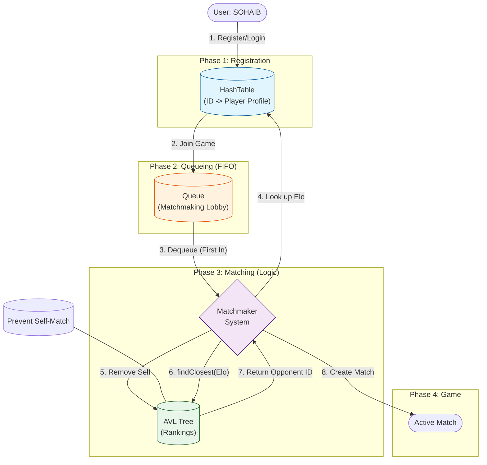
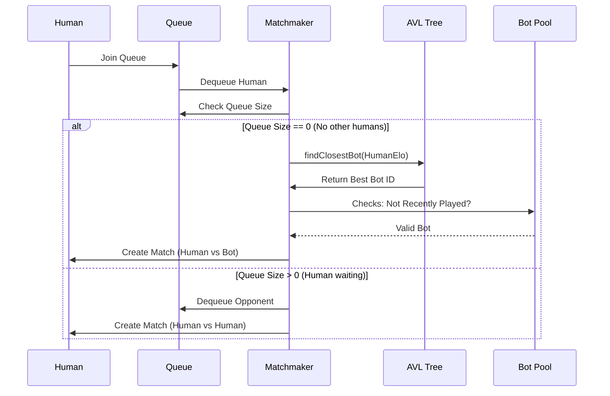

# Visual Data Flows

This document visualizes how data structures interact during the core Matchmaking process.

## 1. Matchmaking Data Flow

This diagram shows the exact journey of a player from joining the lobby to finding a match.

## 2. Data Structure Interaction Details

### Storage (HashTable)
*   **Structure:** Array of Linked Lists (Chaining).
*   **Role:** The "Database" of the system.
*   **Operation:** `get(PlayerID)` is O(1).

### The Lobby (Queue)
*   **Structure:** Linked List with Head/Tail pointers.
*   **Role:** Waiting room.
*   **Operation:** `enqueue()` at Tail, `dequeue()` at Head. O(1).

### The Matcher (AVL Tree)
*   **Structure:** Balanced Binary Search Tree.
*   **Role:** The "Brain". Organizes players by Skill (ELO).
*   **Key Logic:** `findClosest(TargetElo)`
    *   Traverses tree (Left/Right) based on value.
    *   Keeps track of the node with the **smallest absolute difference** (`abs(NodeElo - TargetElo)`).
    *   **Time:** O(log n).

## 3. Bot Matching Logic

When a Human plays against a Bot, the flow is slightly different:

